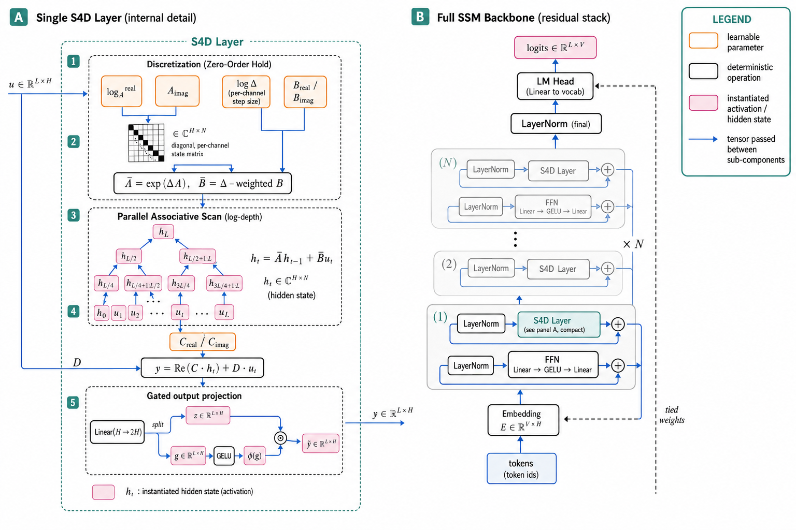
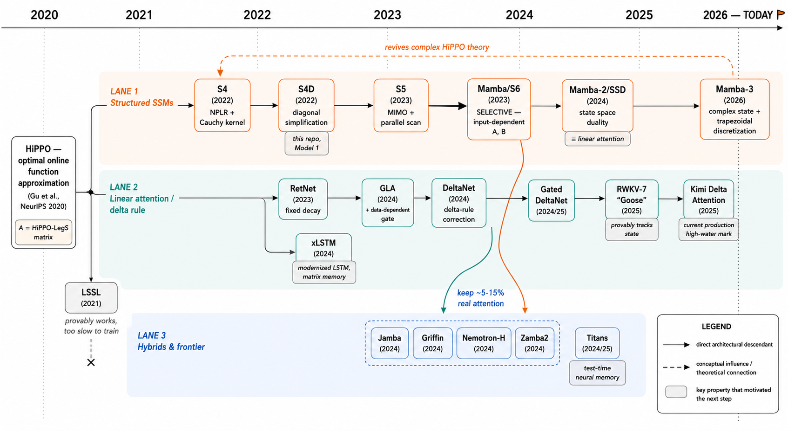
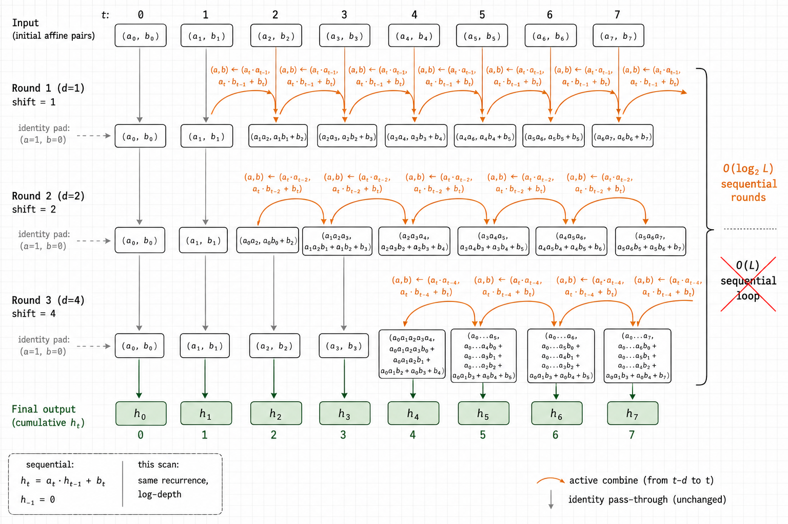
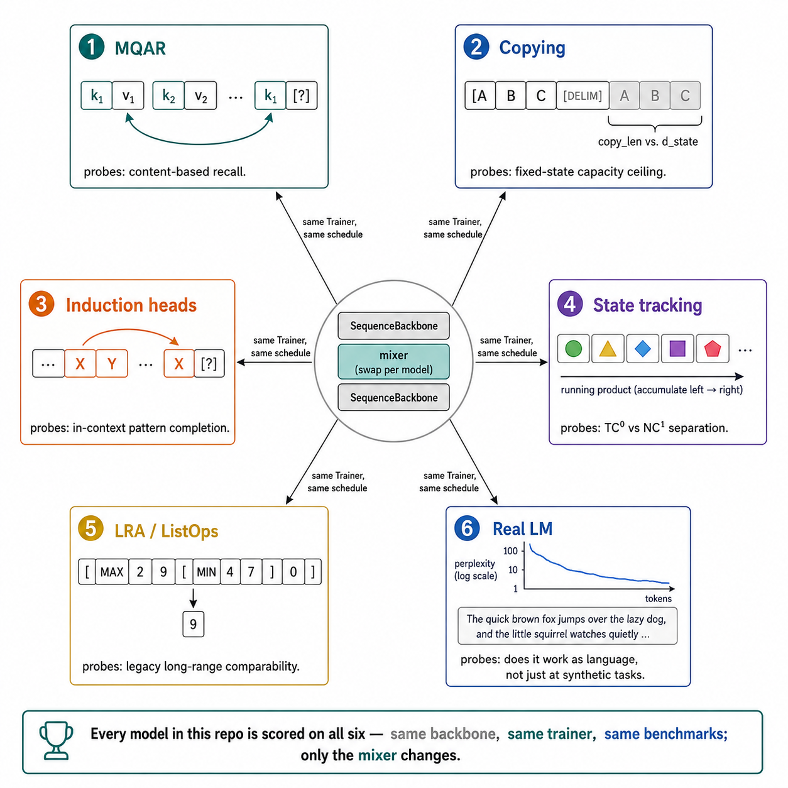
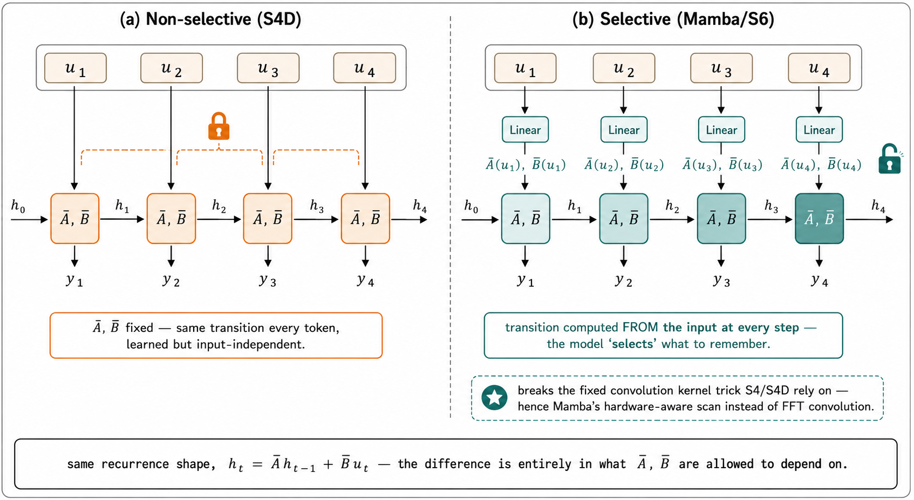
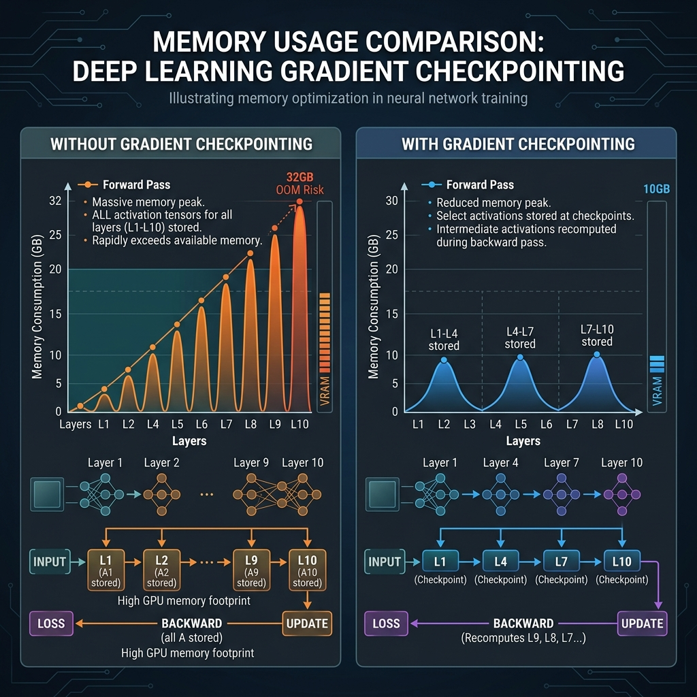
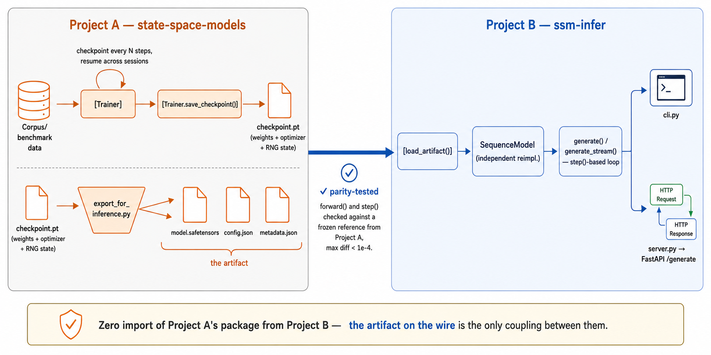
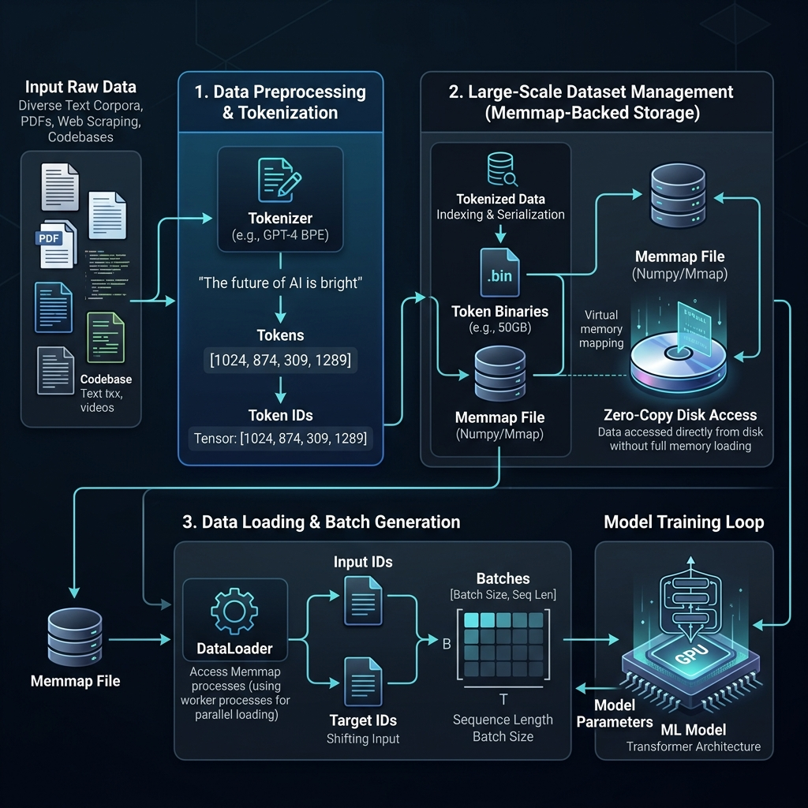
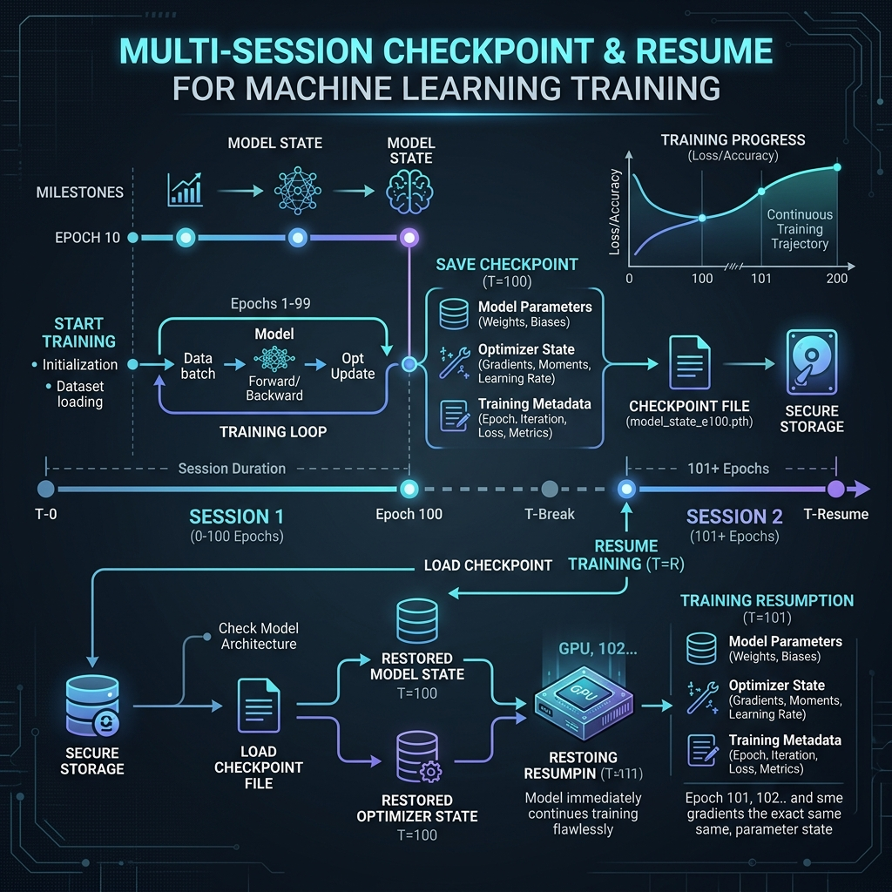
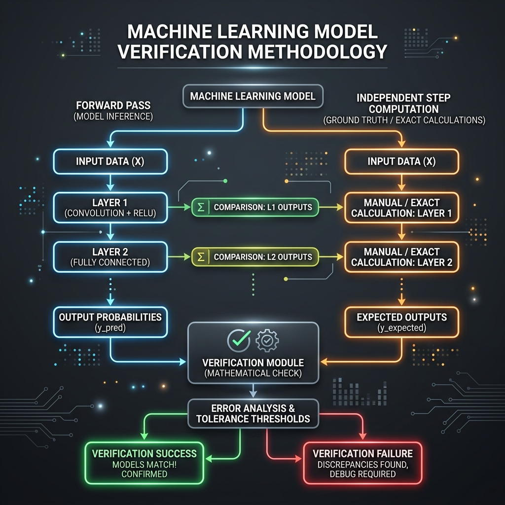

<h1 align="center">state-space-models</h1>

<p align="center">
  A from-scratch, independently-verified comparative study of the sequence architectures<br/>
  trying to replace attention — S4 (2022) through Mamba-3 (2026).
</p>

<p align="center">
  
  
  
  
</p>

<p align="center">
  
</p>

---

Every Mamba repo, DeltaNet repo, and RWKV repo out there will show you a loss curve.

None of them show you the *same* loss curve. Same backbone. Same optimizer schedule. Same six diagnostics. That's because none of them were built to be compared against anything but themselves.

This repo is built to be compared.

Fourteen architectures, one shared residual backbone, one shared trainer, six benchmarks — chosen because published research says they separate architectures for *structural* reasons, not by luck of hyperparameters.

**Model 1 (S4D) and Model 2 (S5) of 14 are done.** Both implemented from their actual recurrence, not a `pip install` wrapper. Both unit-tested against independent reference computations. Both benchmarked on all six diagnostics. S4D scaled past toy size and is deployed behind a running inference server that generates real text.

Twelve more are scoped and queued — see [Roadmap](#roadmap).

---

## Table of contents

- [The shape every model here shares](#the-shape-every-model-here-shares)
- [Research lineage](#research-lineage)
- [How this repo works](#how-this-repo-works)
- [Evaluation methodology](#evaluation-methodology)
- [S4D results](#s4d-results)
- [S5 results](#s5-results)
- [Scaling past the benchmarks](#scaling-past-the-benchmarks)
- [Project B: shipping a trained model](#project-b-shipping-a-trained-model)
- [Repo structure](#repo-structure)
- [Quickstart](#quickstart)
- [Roadmap](#roadmap)
- [Adding the next model](#adding-the-next-model)
- [References](#references)
- [License](#license)

---

## The shape every model here shares

Before any of the fourteen architectures, one question this whole methodology depends on:

Is there a single shape general enough that S4D, Mamba, RWKV-7, and a hybrid attention block can all be an instance of it?

If yes, comparing them stops being "read fourteen papers and squint." It becomes "swap one component, hold everything else fixed."

**Figure 1** above is the answer, in two panels.

**Panel A** — the general scaffolding every state space model reduces to:

- an input map
- a linear recurrent core (`Ā`, `B̄`, `C̄`, `D̄`)
- a nonlinear output gate

However those four matrices get computed — fixed like S4D, input-dependent like Mamba, delta-rule-corrected like DeltaNet — this shape doesn't change.

**Panel B** — what that becomes in actual code:

```
embed
  → [ norm → mixer → residual → norm → FFN → residual ]  × N layers
  → final norm → head
```

That's `ssm_lab.models.backbone.SequenceBackbone`. "Mixer" is a `SequenceMixer` subclass implementing exactly the recurrent core from Panel A — nothing else.

Every one of the fourteen models on the [roadmap](#roadmap) is a different mixer dropped into this exact stack, trained by the exact same `Trainer`. Not a README simplification — it's the literal architecture of `src/ssm_lab/`.

## Research lineage

<p align="center">
  
</p>
<p align="center"><em>Figure 2 — three lineages, one 2020 root. Full writeup with citations: <a href="docs/00_research_lineage.md"><code>docs/00_research_lineage.md</code></a>.</em></p>

Every model on the roadmap sits somewhere on this map. That's not trivia — it's the argument for why the [six benchmarks](#evaluation-methodology) below were chosen instead of just measuring perplexity.

Three things worth knowing before anything else:

**The root is a theorem, not an architecture.**
HiPPO (Gu et al., 2020) proved a specific linear ODE gives a provably optimal *online* compression of history into a fixed-size state. S4's Cauchy-kernel machinery, S4D's diagonal simplification, even Mamba's selective scan — all either built directly on that result, or explicitly reacting to what it can't do.

**"Selective" is the fork in the road.**
S4 and S4D compute a fixed transition — learned, but identical for every token. Mamba's entire contribution: making that transition a *function of the input*, so the model chooses what to remember based on content, not just position.

That one change is why Mamba needed a new scan instead of S4's FFT-convolution trick. It's also the single most important axis this repo's benchmarks are built to detect — see [S4D results](#s4d-results).

**Nobody ships any of this pure.**
Jamba, Nemotron-H, Zamba2, Griffin — every serious production hybrid keeps 5–15% real softmax attention. Pure linear-time models still measurably lose to attention at precise recall and copying, and that gap has an actual theoretical floor (Jelassi et al., 2024).

That's why this repo's benchmark suite includes copying and MQAR specifically, instead of stopping at "does the loss go down."

## How this repo works

### One interface, fourteen fillings

`ssm_lab.layers.base.SequenceMixer` is the entire contract:

- `forward(x)` — `(batch, seq_len, d_model) → (batch, seq_len, d_model)`, causally
- `step(x_t, state)` — the same thing, one token at a time, in O(1) memory (wherever the math allows it)

That second method isn't decoration. It's the actual, measurable reason this architecture family is interesting for deployment — and [Project B](#project-b-shipping-a-trained-model) is where that claim gets tested against a stopwatch instead of just asserted.

### The primitive underneath everything

<p align="center">
  
</p>
<p align="center"><em>Figure 3 — <code>parallel_scan_log</code>: three rounds instead of seven sequential steps.</em></p>

Nearly every model on the roadmap is, underneath its own notation, the same recurrence:

```
h_t = a_t · h_(t-1) + b_t
```

Only the definition of `a_t` and `b_t` changes — constant for S4D and S5, a function of the input for Mamba, a learned forget gate for GLA and RWKV-7.

One scan primitive, `parallel_scan_log`, evaluates all of them in `O(log L)` sequential rounds instead of `L`. It's verified against a plain sequential ground truth to `1e-4`, for both real-valued and complex-valued recurrences (`tests/test_scan.py`) — because S4D's state is complex and Mamba's will be real, and this one function has to be right for both.

### The math both foundation models share

<p align="center">
  
</p>
<p align="center"><em>Figure 11 — continuous ODE → zero-order hold → the discrete recurrence the code actually runs. Same three stages for both S4D and S5.</em></p>

Every model in the S4/S4D/S5 lineage starts continuous and gets discretized the same way — zero-order hold, step size Δ. `Ā` and `B̄` only get computed once per forward pass, not once per timestep; the scan above reuses them for every position.

<p align="center">
  
</p>
<p align="center"><em>Figure 10 — the two diagonal approximations to the HiPPO-LegS spectrum this repo uses, both anchored at Re(λ) = -1/2 for guaranteed stability. <code>ssm_lab.utils.hippo.hippo_diag_spectrum</code> — shared by S4D and S5, not duplicated.</em></p>

That real part is fixed at exactly the same value regardless of which model or which init mode. It's what guarantees the recurrence decays instead of exploding, no matter what the imaginary part (the oscillation frequency) ends up being.

### The backbone and the trainer

`SequenceBackbone` and `Trainer` are the other two shared pieces.

The trainer computes masked cross-entropy from whatever `(x, y, loss_mask)` triple a benchmark hands it:

- next-token-shifted for MQAR, copying, induction
- same-position labelling for parity and S5 state-tracking
- every-position for real text

Adding a benchmark never touches the training loop. Adding a model never touches the benchmarks.

## Evaluation methodology

<p align="center">
  
</p>
<p align="center"><em>Figure 4 — same backbone, same trainer, six different reasons to fail.</em></p>

Most repos report one number: loss went down. That number can't tell you *why* one architecture beats another — a dozen different capabilities all compress into the same scalar.

Six benchmarks instead, each picked because a specific paper demonstrated it isolates a specific capability:

| Benchmark | What it probes | Why this one |
|---|---|---|
| **MQAR** | Content-based associative recall | Arora et al. (2024, *Zoology*) — more predictive of real LM quality than perplexity alone |
| **Copying** | Fixed-state capacity ceiling | Direct reproduction of Jelassi et al. (2024)'s provable copying-length ceiling |
| **Induction heads** | In-context pattern completion | Olsson et al. (2022) — the exact circuit Mamba's selective mechanism targets |
| **Parity + S5 tracking** | TC⁰ vs. NC¹ expressivity | Merrill et al. (2024) — diagonal decay-only recurrences are provably stuck in TC⁰ |
| **LRA / ListOps** | Legacy long-range comparability | Kept as a secondary metric only — see the honesty note below |
| **Real language modeling** | Does it work as language, not just at toy tasks | Byte-level, `np.memmap`-backed, corpus size never touches RAM |

> **On LRA:** recent analysis found most LRA tasks solvable by a <30-token receptive field. It's included here for comparability with older papers — not treated as a headline result.

Generators, tests, and exact task construction: `src/ssm_lab/benchmarks/`.

## S4D results

<p align="center">
  
</p>
<p align="center"><em>Figure 5 — same recurrence shape on both sides. The only difference: what Ā, B̄ are allowed to depend on.</em></p>

S4D's transition is the left side of Figure 5 — a learned constant, no mechanism to route on content.

That's not a weakness discovered after the fact. It's a structural prediction, made in `docs/01_s4.md` *before* the notebook ran, then checked against what happened:

- **Copying** — holds up cleanly until `copy_len` approaches `d_state`, then falls off a genuine capacity cliff. Exactly the Jelassi et al. result, reproduced directly.
- **MQAR and induction heads** — weak, close to chance. Both need "notice this token, remember it, retrieve it on demand" — no mechanism for that here.
- **Parity and S5 tracking** — weak to failing, S5 more so. The Merrill et al. TC⁰ ceiling, made concrete.
- **Real language modeling** — still works. A 69K-parameter model took byte-level validation perplexity from chance (256) to **11.4** in 200 steps on real text (`notebooks/01_s4.ipynb` §5).

None of this is a bug list.

It's the point of building S4D first — it gives the next twelve models something specific to beat, on axes chosen for real structural reasons. Full reasoning: `docs/01_s4.md`.

<details>
<summary><b>S4D's internals, traced end to end</b></summary>
<br/>

<p align="center">
  
</p>
<p align="center"><em>Figure 7 — every tensor shape in <code>S4DLayer.forward()</code>, traced from input to output.</em></p>

The one detail worth carrying forward from this figure: the readout step, `y = Re(C·h) + D·u`, is drawn as an **elementwise** operation — one lane per channel, never crossing into another channel's state. That's the exact thing Figure 9 (below, in the S5 section) redraws as a matrix product instead. Same variable names, structurally different operation — that difference *is* SISO vs. MIMO.

</details>

## S5 results

<p align="center">
  
</p>
<p align="center"><em>Figure 9 — same recurrence math on both sides. Left: S4D, four channels, four isolated states, no crossing lines. Right: S5, four channels, one shared state, every line crosses.</em></p>

S5 changes a different axis entirely: one shared recurrent state mixing across every channel, instead of S4D's `d_model` independent per-channel states. MIMO instead of SISO.

It does **not** change selectivity. $\bar A$ is still a learned constant in S5, same as S4D. That's the prediction `docs/02_s5.md` makes before running anything: S5 should fail the *same* benchmarks S4D fails, for the *same* reason, and only clearly separate from S4D on throughput.

The dev-run numbers backed that up closely:

<p align="center">
  
</p>
<p align="center"><em>Figure 16 — MQAR and induction heads: both near chance, both architectures. Real LM: both clearly working, S5 slightly ahead.</em></p>

| Benchmark | S4D | S5 |
|---|---|---|
| MQAR | 0.021 (chance ≈ 0.03) | 0.025 (chance ≈ 0.03) |
| Induction heads | near chance | 0.062 (chance = 0.0625) |
| Real LM perplexity | 256 → 11.4 | 256 → 10.8 |

Both near chance on MQAR and induction, both working fine at real language modeling. That's not a disappointing result for S5 — it's direct evidence that *selectivity*, not *MIMO-ness*, is what actually governs recall. Exactly what motivated writing the prediction down before training anything.

One thing S5 does verifiably do differently: `tests/test_s5.py` checks that perturbing a single input channel measurably affects multiple output channels — real cross-channel mixing inside the recurrence, which S4D's per-channel isolation structurally can't produce. MIMO and selective are different axes. This model is the concrete proof they're different, not just an assertion that they should be.

Model 3 (Mamba) is where this repo's roadmap finally changes the selectivity axis. Full reasoning and the complete results table: `docs/02_s5.md`.

<details>
<summary><b>S5's internals, traced end to end — and set beside S4D's</b></summary>
<br/>

<p align="center">
  
</p>
<p align="center"><em>Figure 8 — the mirror of Figure 7. Same discretization formula, same scan primitive. The two boxes that differ: <code>B̄@u_t</code> and <code>C@h_t</code> are drawn as matrix icons here, not elementwise lanes — and the state tensor <code>h</code> has no <code>d_model</code> dimension at all.</em></p>

Put Figures 7 and 8 side by side and the entire architectural difference between these two models is exactly two boxes. Everything else — parameter bank layout, discretization math, the scan itself, the gated output projection — is the same diagram, redrawn.

</details>

## Scaling past the benchmarks

Benchmark-scale models — thousands of parameters, hundreds of steps — prove structural properties cheaply. They don't prove the codebase can train something worth calling "larger." That got verified separately, not assumed:

<p align="center">
  
</p>
<p align="center"><em>Figure 14 — standard backprop holds every layer's activations at once. Checkpointing recomputes them during backward instead of storing them.</em></p>

**Gradient checkpointing**
`BackboneConfig(use_gradient_checkpointing=True)`. Proven numerically transparent — identical loss and gradients on vs. off. And concretely: a config that OOM-killed this repo's CPU-only sandbox now completes successfully with it on. Rerunnable fact, not a claim (`tests/test_grad_checkpointing.py`).

**Gradient accumulation**
`grad_accum_steps=k`. Verified equivalent to one k-times-larger batch, to `~1e-8`.

**Checkpoint / resume**
Exact model, optimizer, and RNG-stream restoration across sessions — verified by reloading into a *differently-initialized* fresh model and checking bit-identical eval loss. This is exactly what let the Shakespeare model below get trained in five separate sessions instead of one long one.

**Named scaling presets**
`ssm_lab.models.presets` — tiny (112K) → small (4.6M) → medium (34M) → large (102M) parameters. Real counts, computed from this exact codebase.

Full guide, including pointing this at WikiText-103 or a FineWeb-Edu shard instead of a toy corpus: [`docs/scaling_up.md`](docs/scaling_up.md).

## Project B: shipping a trained model

<p align="center">
  
</p>
<p align="center"><em>Figure 17 — the roadmap grows on the left. What Project B needs to know about it never changes on the right.</em></p>

A repo that only produces loss curves hasn't really answered "does this work."

So this repo trains, and a **separate, independent project** — [`ssm-infer`](https://github.com/YOUR_USERNAME/ssm-infer) — serves.

Two repos, not two folders. Training code optimizes for flexibility: fourteen architectures behind a registry, full optimizer/RNG state, resumability. Serving code optimizes for a small, auditable footprint. It shouldn't need to import a research package just to run a forward pass.

### The handoff

<p align="center">
  
</p>
<p align="center"><em>Figure 6 — the crossing arrow from Figure 17, zoomed in.</em></p>

The handoff, in code:

```
Trainer.save_checkpoint()          weights + optimizer + RNG state, needs ssm_lab to load
        ↓
scripts/export_for_inference.py    strips to weights only
        ↓
model.safetensors + config.json + metadata.json
        ↓
ssm_infer.artifact.load_artifact()  zero ssm_lab dependency, on the other side
```

`ssm-infer`'s `model.py` is a from-scratch, independent reimplementation of the S4D math — not an import. That's a real risk: a reimplementation that quietly drifts would silently misrepresent what a trained checkpoint computes.

That risk is exactly what the parity test suite closes. Project B's `forward()` and `step()` are both checked against a frozen reference computed directly from Project A's real model, on the same weights.

**Max diff: `< 1e-4`.** Or the test suite fails, loudly.

### Training a real model to serve

<p align="center">
  
</p>
<p align="center"><em>Figure 18 — raw text to trained weights, one pipeline. The same one every synthetic benchmark's <code>(x, y, loss_mask)</code> triple already flows through.</em></p>

To have something real to serve, a real model got trained:

- 97,200 parameters
- 2,500 steps, byte-level, on tiny-shakespeare
- five separate checkpointed sessions (this sandbox can't do 2,500 steps in one sitting)
- validation perplexity: 256 (chance) → **6.22**

<p align="center">
  
</p>
<p align="center"><em>Figure 15 — five separate sessions. One continuous <code>global_step</code>. This is the actual training history of the model below, not a hypothetical.</em></p>

```
ROMEO:
We with me soundly the dose one one our butt so the day she love not
that hard Rome shall.

ESCALUS:
Letter leave us.
```

Not coherent Shakespeare. A 97K-parameter model trained briefly on 1MB of text, and it shows.

What it *does* show: correct character-name formatting, archaic pronouns (thou/thy/hath) it was never told to use, plausible line breaks. Real learned structure — a small model's honest ceiling, not oversold.

### The actual point of `step()`

Measured by `ssm-infer/benchmark_inference.py`, not asserted:

| Tokens generated so far | Recurrent state size | Time for one more token |
|---|---|---|
| 10 | 18,432 bytes | 1.09 ms |
| 1,000 | 18,432 bytes | 1.21 ms |
| 2,000 | 18,432 bytes | 1.06 ms |

State size: identical at every position. Per-token time: flat — 1.24× max/min ratio across that whole range, which is noise, not a trend.

Token #2,000 costs exactly what token #10 did. The state `step()` carries forward has a fixed size that never grows — unlike a Transformer's KV cache, which would show that ratio climbing with length on the same benchmark.

That's the entire practical argument for this architecture family. Made falsifiable, not just asserted.

## Repo structure

<p align="center">
  
</p>
<p align="center"><em>Figure 13 — the tree below shows what's there. This shows how it fits together: strictly upward dependencies, backbone.py never importing a specific mixer.</em></p>

```
src/ssm_lab/
├── layers/              one file per architecture (s4d.py, s5.py, ...) — all
│                        implement SequenceMixer (base.py) + registry.py
├── models/
│   ├── backbone.py      the one residual stack every mixer plugs into
│   └── presets.py       named scaling tiers, real param counts
├── training/
│   └── trainer.py       gradient accumulation + checkpoint save/resume live here
├── data/
│   ├── tokenizer.py      byte-level tokenizer
│   └── text_lm.py        real-corpus prep, memmap-backed loading
├── benchmarks/
│   ├── mqar.py
│   ├── copying.py
│   ├── state_tracking.py
│   ├── induction_heads.py
│   └── lra/              ListOps + stubs for the rest
└── utils/
    ├── scan.py           the O(log L) primitive every model reduces to
    └── hippo.py          shared diagonal-HiPPO init, used by S4D and S5 both

scripts/
└── export_for_inference.py   the handoff to ssm-infer

notebooks/    one notebook per model, Kaggle/Colab-ready
tests/        scan correctness, forward-vs-step, benchmarks, checkpoints,
              gradient accumulation, gradient checkpointing, the export handoff
docs/         research lineage, per-model math, scaling guide, model template
results/      JSON results + plots, one file per model
```

## Quickstart

**On Kaggle or Colab:**

Open `notebooks/00_setup_and_smoke_test.ipynb`. Set `REPO_URL` in the first cell to your fork. Run all cells.

Proves the whole stack — scan correctness, S4D forward-vs-recurrence equivalence, an end-to-end training run — in under a minute on CPU. Then run `01_s4.ipynb`, then `02_s5.ipynb`.

**Locally:**

```bash
git clone <this repo>
cd state-space-models

pip install -e .
pip install -r requirements-dev.txt

pytest tests/ -v
jupyter notebook notebooks/00_setup_and_smoke_test.ipynb
```

**Just want to generate text, not train anything?**

Go straight to [`ssm-infer`](https://github.com/YOUR_USERNAME/ssm-infer) — it ships a trained model.

## Roadmap

| # | Model | Family | Status |
|---|-------|--------|--------|
| 1 | S4D | foundation | **done** |
| 2 | S5 | foundation | **done** |
| 3 | Mamba / S6 | mamba lineage | next up — first selective (input-dependent) transition |
| 4 | Mamba-2 / SSD | mamba lineage | planned |
| 5 | Mamba-3 | mamba lineage | planned |
| 6 | RetNet | linear-attn family | planned |
| 7 | GLA | linear-attn family | planned |
| 8 | DeltaNet / Gated DeltaNet | linear-attn family | planned |
| 9 | RWKV-7 "Goose" | linear-attn family | planned |
| 10 | xLSTM (mLSTM) | linear-attn family | planned |
| 11 | Jamba-style block | hybrid | planned |
| 12 | Griffin | hybrid | planned |
| 13 | Vision Mamba | applied | planned |
| 14 | Titans (mini) | memory frontier | planned |

Full rationale, build order, what's already shipped: [`ROADMAP.md`](ROADMAP.md).

## Adding the next model

Every step — layer implementation, registry entry, tests, notebook template, docs page — is written down once: [`docs/how_to_add_a_model.md`](docs/how_to_add_a_model.md).

The short version:

1. Copy `src/ssm_lab/layers/s4d.py`'s structure.
2. Implement the layer's actual recurrence.
3. Write the one test that matters most: check `forward()` against an independently-computed, `step()`-by-`step()` recurrence.

<p align="center">
  
</p>
<p align="center"><em>Figure 12 — run for S4D. Run for S5. Run for every model still on the roadmap before its first benchmark.</em></p>

That third step is what catches discretization bugs. "It ran without erroring" doesn't.

## References

Full citation list with venues and years: [`docs/00_research_lineage.md`](docs/00_research_lineage.md#references).

Load-bearing papers referenced above:

- Gu, Dao, Ermon, Rudra & Ré — *HiPPO* (2020)
- Gu, Goel & Ré — *S4* (2022)
- Gu, Gupta, Goel & Ré — *S4D* (2022)
- Smith, Warrington & Linderman — *S5* (2023)
- Gu & Dao — *Mamba* (2023)
- Dao & Gu — *Mamba-2 / State Space Duality* (2024)
- Jelassi, Brandfonbrener, Kakade & Malach — *Repeat After Me* (2024)
- Merrill, Petty & Sabharwal — *The Illusion of State in State-Space Models* (2024)
- Arora et al. — *Zoology* (2024)
- Olsson et al. — *In-context Learning and Induction Heads* (2022)
- Tay et al. — *Long Range Arena* (2020)

## License

MIT — see [`LICENSE`](LICENSE).

---

<sub>Originally named "state spaced models" (typo). Worth fixing to `state-space-models` before this is resume-facing — GitHub redirects the old URL automatically once renamed.</sub>
